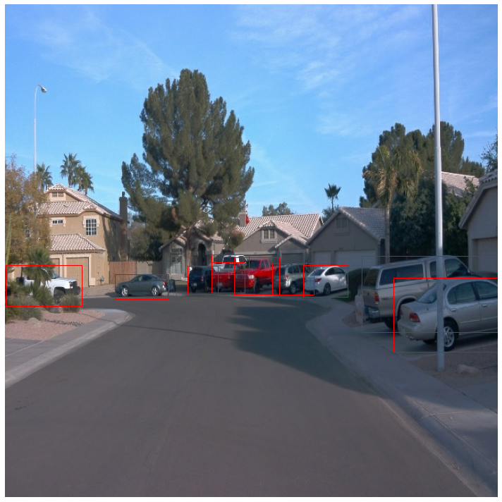

# Object Detection in an Urban Environment

This is a detailed repository of Computer Vision Module for Udacity Self Driving Car ND.
In this project, I will apply the skills to create a convolutional neural network to detect and classify objects using data from Waymo.

## Data

For this project, we will be using data from the [Waymo Open dataset](https://waymo.com/open/).

[OPTIONAL] - The files can be downloaded directly from the website as tar files or from the [Google Cloud Bucket](https://console.cloud.google.com/storage/browser/waymo_open_dataset_v_1_2_0_individual_files/) as individual tf records. We have already provided the data required to finish this project in the workspace, so you don't need to download it separately.

## Structure

### Data

The data you will use for training, validation and testing is organized as follow:
```
./data/waymo
    - train: contain the train data 
    - valid: contain the val data
    - test - contain the test data
```
In the Colab environment, download_process.py was used to have the above data configuration, and the code was filled in create_split.py. Pleare refer to the (in_Colab)_from_download_dataset_until_object_detection.ipynb

### Experiments
The experiments folder will be organized as follow:
```
experiments/
    - pretrained_model/ - contains the checkpoints of the pretrained models. ( SSD Resnet 50 640x640)
    - exporter_main_v2.py - to create an inference model
    - model_main_tf2.py - to launch training

    - experiment0/ - first experiment based on pipeline.config, which is for a SSD Resnet 50 640x640 model
                     batch_size = 2
    
    - experiment1/ - improved experiment with pipeline.config, which is for a SSD Resnet 50 640x640 model
                    batch_size = 4 and data augmentation is applied

```

## Prerequisites

### Local Setup

For local setup if you have your own Nvidia GPU, you can use the provided Dockerfile and requirements in the [build directory](./build).

Follow [the README therein](./build/README.md) to create a docker container and install all prerequisites.

### Download and process the data

**Note:** ”If you are using the classroom workspace, we have already completed the steps in the section for you. You can find the downloaded and processed files within the `/home/workspace/data/preprocessed_data/` directory. Check this out then proceed to the **Exploratory Data Analysis** part.

The first goal of this project is to download the data from the Waymo's Google Cloud bucket to your local machine. For this project, we only need a subset of the data provided (for example, we do not need to use the Lidar data). Therefore, we are going to download and trim immediately each file. In `download_process.py`, you can view the `create_tf_example` function, which will perform this processing. This function takes the components of a Waymo Tf record and saves them in the Tf Object Detection api format. An example of such function is described [here](https://tensorflow-object-detection-api-tutorial.readthedocs.io/en/latest/training.html#create-tensorflow-records). We are already providing the `label_map.pbtxt` file.

You can run the script using the following command:
```
python download_process.py --data_dir {processed_file_location} --size {number of files you want to download}
```

You are downloading 100 files (unless you changed the `size` parameter) so be patient! Once the script is done, you can look inside your `data_dir` folder to see if the files have been downloaded and processed correctly.

**Note:** There was additional work to be done to work in the colab environment. 
See (in_Colab)_from_download_dataset_until_object_detection.ipynb for details.

### Classroom Workspace

In the classroom workspace, every library and package should already be installed in your environment. You will NOT need to make use of `gcloud` to download the images.

## Instructions

### Exploratory Data Analysis

You should use the data already present in `/home/workspace/data/waymo` directory to explore the dataset! This is the most important task of any machine learning project. To do so, open the `Exploratory Data Analysis` notebook. In this notebook, your first task will be to implement a `display_instances` function to display images and annotations using `matplotlib`. This should be very similar to the function you created during the course. Once you are done, feel free to spend more time exploring the data and report your findings. Report anything relevant about the dataset in the writeup.

Keep in mind that you should refer to this analysis to create the different spits (training, testing and validation).

**Note** 
For images, charts and other visualizations, please refer to Exploratory Data Analysis.ipynb

### Create the training - validation splits
In the class, we talked about cross-validation and the importance of creating meaningful training and validation splits. For this project, you will have to create your own training and validation sets using the files located in `/home/workspace/data/waymo`. The `split` function in the `create_splits.py` file does the following:
* create three subfolders: `/home/workspace/data/train/`, `/home/workspace/data/val/`, and `/home/workspace/data/test/`
* split the tf records files between these three folders by symbolically linking the files from `/home/workspace/data/waymo/` to `/home/workspace/data/train/`, `/home/workspace/data/val/`, and `/home/workspace/data/test/`

Use the following command to run the script once your function is implemented:
```
python create_splits.py --data-dir /home/workspace/data
```

**Note** 
To create the different splits: training, validation and testing, I implemeted split_data function in the create_splits.py
Cross validation is a set of techniques to evaluate the capacity of our model to generalize and alleviate the overfitting challenges. I splitted as follows
a training set - 75%, a validation set - 15%, a test set - 10%

### Edit the config file

Now you are ready for training. As we explain during the course, the Tf Object Detection API relies on **config files**. The config that we will use for this project is `pipeline.config`, which is the config for a SSD Resnet 50 640x640 model. You can learn more about the Single Shot Detector [here](https://arxiv.org/pdf/1512.02325.pdf).

First, let's download the [pretrained model](http://download.tensorflow.org/models/object_detection/tf2/20200711/ssd_resnet50_v1_fpn_640x640_coco17_tpu-8.tar.gz) and move it to `/home/workspace/experiments/pretrained_model/`.

We need to edit the config files to change the location of the training and validation files, as well as the location of the label_map file, pretrained weights. We also need to adjust the batch size. To do so, run the following:
```
python edit_config.py --train_dir /home/workspace/data/train/ --eval_dir /home/workspace/data/val/ --batch_size 2 --checkpoint /home/workspace/experiments/pretrained_model/ssd_resnet50_v1_fpn_640x640_coco17_tpu-8/checkpoint/ckpt-0 --label_map /home/workspace/experiments/label_map.pbtxt
```
A new config file has been created, `pipeline_new.config`.

### Training

You will now launch your very first experiment with the Tensorflow object detection API. Move the `pipeline_new.config` to the `/home/workspace/experiments/reference` folder. Now launch the training process:
* a training process:
```
python experiments/model_main_tf2.py --model_dir=experiments/reference/ --pipeline_config_path=experiments/reference/pipeline_new.config
```
Once the training is finished, launch the evaluation process:
* an evaluation process:
```
python experiments/model_main_tf2.py --model_dir=experiments/reference/ --pipeline_config_path=experiments/reference/pipeline_new.config --checkpoint_dir=experiments/reference/
```

**Note**: Both processes will display some Tensorflow warnings, which can be ignored. You may have to kill the evaluation script manually using
`CTRL+C`.

To monitor the training, you can launch a tensorboard instance by running `python -m tensorboard.main --logdir experiments/experiment0/`. You will report your findings in the writeup.


### Improve the performances

Most likely, this initial experiment did not yield optimal results. However, you can make multiple changes to the config file to improve this model. One obvious change consists in improving the data augmentation strategy. The [`preprocessor.proto`](https://github.com/tensorflow/models/blob/master/research/object_detection/protos/preprocessor.proto) file contains the different data augmentation method available in the Tf Object Detection API. To help you visualize these augmentations, we are providing a notebook: `Explore augmentations.ipynb`. Using this notebook, try different data augmentation combinations and select the one you think is optimal for our dataset. Justify your choices in the writeup.

Keep in mind that the following are also available:
* experiment with the optimizer: type of optimizer, learning rate, scheduler etc
* experiment with the architecture. The Tf Object Detection API [model zoo](https://github.com/tensorflow/models/blob/master/research/object_detection/g3doc/tf2_detection_zoo.md) offers many architectures. Keep in mind that the `pipeline.config` file is unique for each architecture and you will have to edit it.

**Important:** If you are working on the workspace, your storage is limited. You may to delete the checkpoints files after each experiment. You should however keep the `tf.events` files located in the `train` and `eval` folder of your experiments. You can also keep the `saved_model` folder to create your videos.


### Creating an animation
#### Export the trained model
Modify the arguments of the following function to adjust it to your models:

```
python experiments/exporter_main_v2.py --input_type image_tensor --pipeline_config_path experiments/reference/pipeline_new.config --trained_checkpoint_dir experiments/reference/ --output_directory experiments/reference/exported/
```

This should create a new folder `experiments/reference/exported/saved_model`. You can read more about the Tensorflow SavedModel format [here](https://www.tensorflow.org/guide/saved_model).

Finally, you can create a video of your model's inferences for any tf record file. To do so, run the following command (modify it to your files):
```
python inference_video.py --labelmap_path label_map.pbtxt --model_path experiments/reference/exported/saved_model --tf_record_path /data/waymo/testing/segment-12200383401366682847_2552_140_2572_140_with_camera_labels.tfrecord --config_path experiments/reference/pipeline_new.config --output_path animation.gif
```

## Submission Template

### Project overview
This is a detailed repository of Computer Vision Module for Udacity Self Driving Car ND.
In this project, I will apply the skills to create a convolutional neural network to detect and classify objects using data from Waymo.

### Set up
I have used Tesla P100 in Google Colaboratory

Install Tensorflow Object Detection API
- https://tensorflow-object-detection-api-tutorial.readthedocs.io/en/latest/install.html#tensorflow-object-detection-api-installation

Git Clone of Udacity Project Starter
- https://github.com/udacity/nd013-c1-vision-starter.git

Install Waymo Open Data Set
- https://colab.research.google.com/github/waymo-research/waymo-open-dataset/blob/master/tutorial/tutorial.ipynb#scrollTo=sLIUOJzSyjj6

Download and Process (waymo dataset)
- python download_process.py --data_dir ./data

Reinstall cuda and cudnn in Google Colab
- for cuda :  https://developer.download.nvidia.com/compute/cuda/repos/ubuntu1804/x86_64/cuda-ubuntu1804.pin
- for cudnn : https://developer.nvidia.com/compute/machine-learning/cudnn/secure/8.1.0.77/11.2_20210127/Ubuntu18_04-x64/libcudnn8_8.1.0.77-1+cuda11.2_amd64.deb

**Note**
Pleare refer to the (in_Colab)_from_download_dataset_until_object_detection.ipynb

### Dataset

Images are taken in different environments(subway/highway/city) with different weather conditions(foggy/sunny) and different times of the day(day/night).The bounding boxes are red for the vehicles, green for the cyclists and blue for the pedestrians.





#### Dataset analysis


Further analysis of the dataset shows that most images contain vehicles and pedestrians (majority vehicles), and very few sample images have cyclists in them. The chart below shows a bar plot for the distribution of classes (cars, pedestrians, and cyclists), over a collection of 20000 random images in the dataset. 


*Distribution of Cars*


The highest point is when the number of vehicles per image is 1~2, and it gradually decreases, so it is rarely more than 60.


*Distribution of Pedestrians*


The highest point is when the number of pedestrians per image is 1~2, and the number of pedestrians per image is the highest, and it is rarely more than 40.


*Distribution of Cyclits*


The cyclist is also often included in the image with about 1 person, and it is slightly distributed among 2-6 people.


#### Cross validation
To create the different splits: training, validation and testing, I implemeted split_data function in the create_splits.py
Cross validation is a set of techniques to evaluate the capacity of our model to generalize and alleviate the overfitting challenges. First I shuffled the data randomly and then splitted into training,testing and validation sets.
I used a training set - 75%, a validation set - 15%, a test set - 10% of 100 tfrecord samples.

### Training
#### Reference experiment
The Single Shot Detector (SSD Resnet 50 640x640) without augmentation , model loss is shown below: 

Precision


Recall


Loss


 'Loss/classification_loss': 0.7530304,
 'Loss/localization_loss': 1.115476,
 'Loss/regularization_loss': 8608118.0,
 'Loss/total_loss': 8608120.0,
 'learning_rate': 0.0
 
Loss is gradually decreased. But it is not great.
(Evaluation curve is not displayed in tensorboard)

#### Improve on the reference
To improve on the model performance, probability of grayscale conversion, contrast values, and brightness are adjusted.
Changes are in pipeline_new.config

##### Edit pipeline_new.config

data_augmentation_options {
    random_rgb_to_gray {
    probability: 0.2
    }
  }
  data_augmentation_options {
    random_adjust_contrast {
    min_delta: 0.6
    max_delta: 1.0
    }
  }
  data_augmentation_options {
    random_adjust_brightness {
    max_delta: 0.3
    }
  }


Gray scaled


Bright image


Bright image


Gray scaled


Precision with augmentations


Recall with augmentations


Loss with augmentations


 'Loss/classification_loss': 0.21389142,
 'Loss/localization_loss': 0.21148735,
 'Loss/regularization_loss': 0.23820335,
 'Loss/total_loss': 0.6635821,
 'learning_rate': 0.0


The loss is lower than the previous loss


